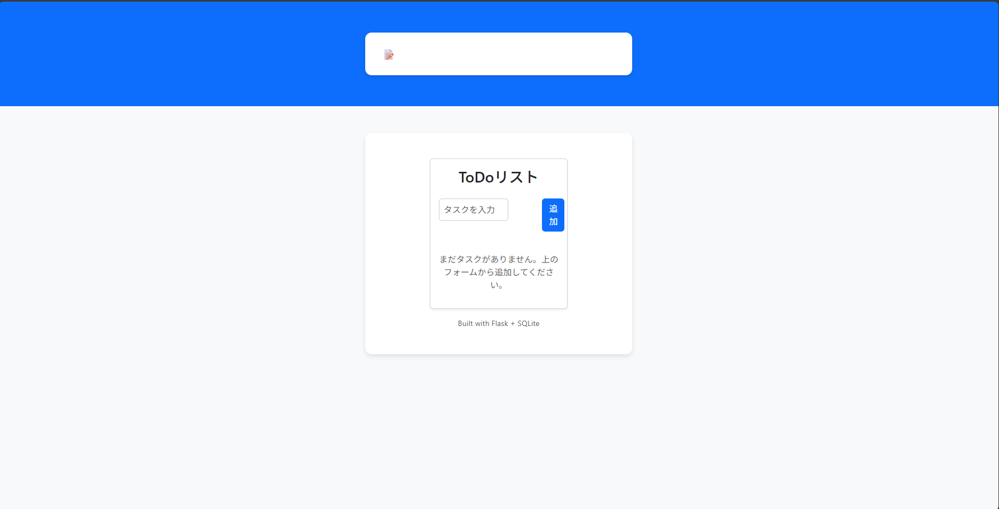
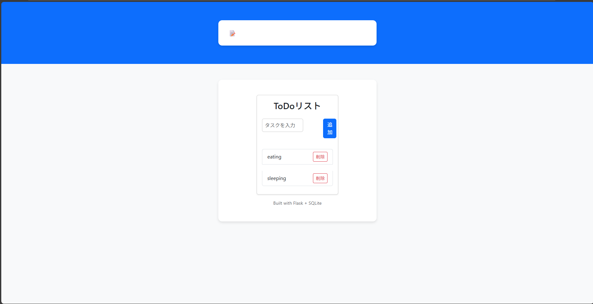
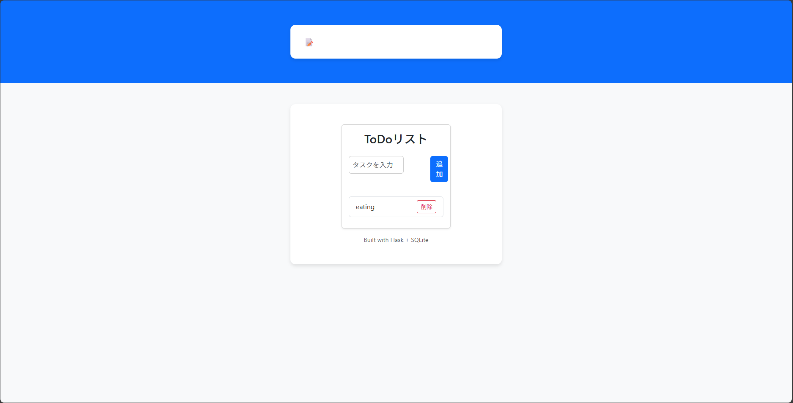

# Flask ToDo (SQLite)

[]()
[]()
[]()

Flask + SQLite で作成したシンプルな ToDo アプリです。  
**追加 / 一覧表示 / 削除** の最小機能を、学習～面接説明まで使いやすい構成でまとめました。

- **デモ**：🔗 https://🔁あなたのRenderURL  
- **技術**：Python / Flask / SQLite / Bootstrap 5

---

## 📸 Screenshots

| 一覧 | 追加 | 削除 |
|---|---|---|
|  |  |  |

---

## 🚀 使い方（ローカル）

```bash
# 1) 仮想環境（任意）
python -m venv venv
venv\Scripts\activate   # Windows

# 2) 依存インストール
pip install -r requirements.txt

# 3) 起動
python app.py
# http://127.0.0.1:5000 を開く
